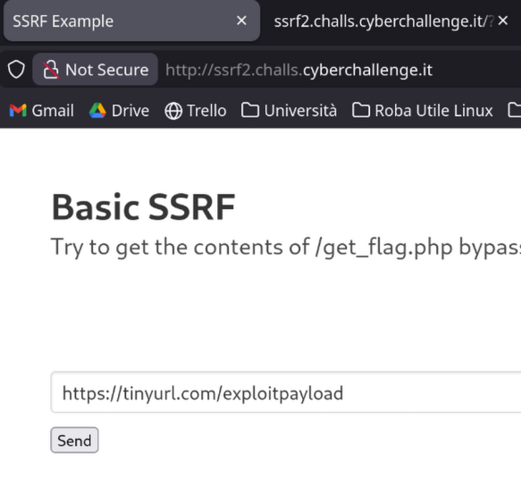
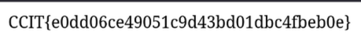

Si sfrutta la vulnerabilità di file_get_contents() di seguire il protocollo http di redirect


Creiamo un URL con https://tinyurl.com/ e mettiamo come "long URL" ```http://localhost/get_flag.php``` e mettiamo il link risultante dentro al box di testo del sito e ci darà la flag perchè aggiriamo tutti i check.







Però ho come l'impressione che questo metodo non sia quello "giusto" a livello didattico. Cioè io credo che l'intento sia quello di bucare i check in qualche modo utilizzando prefissi etc a livello IP.