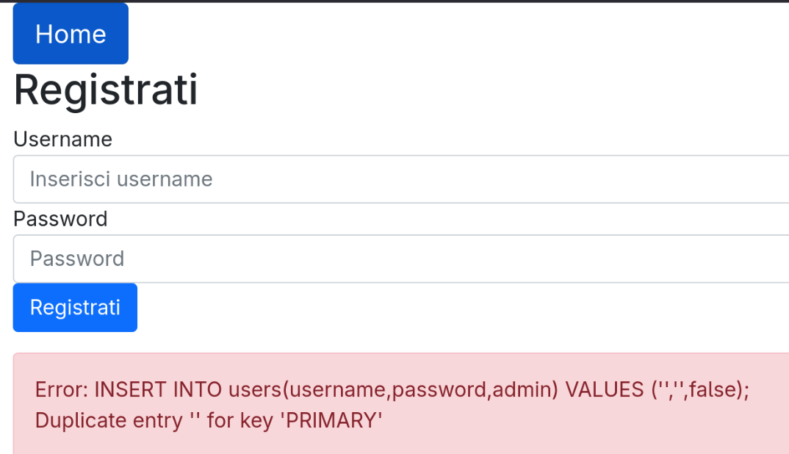
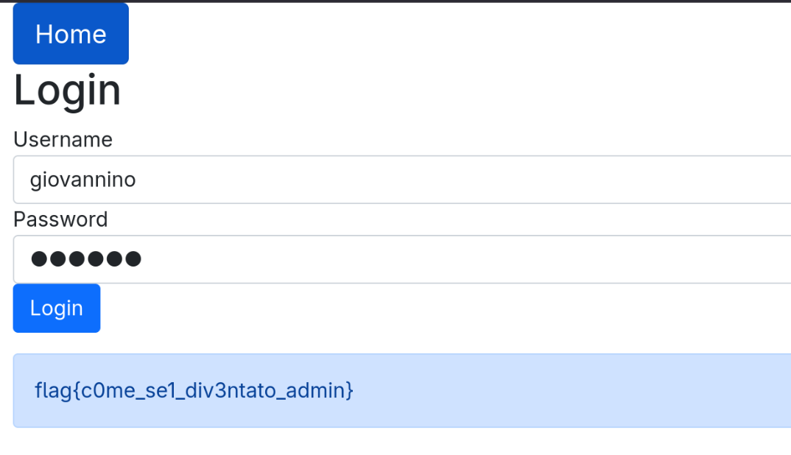

# Admins_secret

http://adminsecret.challs.olicyber.it

## Spiegazione

E' una forma di SQL injections dove non si estrea informazione tramite una select, ma ci si registra mettendo a "true" il boolean flag che
determina se siamo admin o meno.



In questo errore si capisce che forse siamo direttamente collegati al DB senza prepared statements.

Quindi possiamo escapare con ``` -- ``` e mettiamo noi un payload che ci registra appropriatamente, allora otteniamo il ruolo da admin:

```
giovannino','passwd',true); -- 
```
