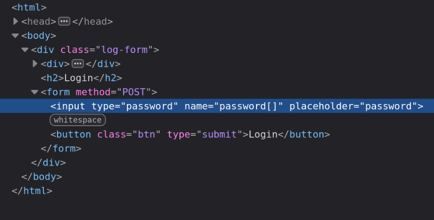

# C Style Login

http://clogin.challs.olicyber.it/

## Spiegazione

Si sfrutta la stessa vulneribilità di sound of silence.

Si passa ad un strcmp un array rimpiazzando nell'HTML il ```name=password``` con ```name=password[]```



Questo fa fallire strcmp e ritorna 0 e PHP procede comunque, non interrompe l'esecuzione. E quindi stampa la flag in quanto l'IF si passa.

