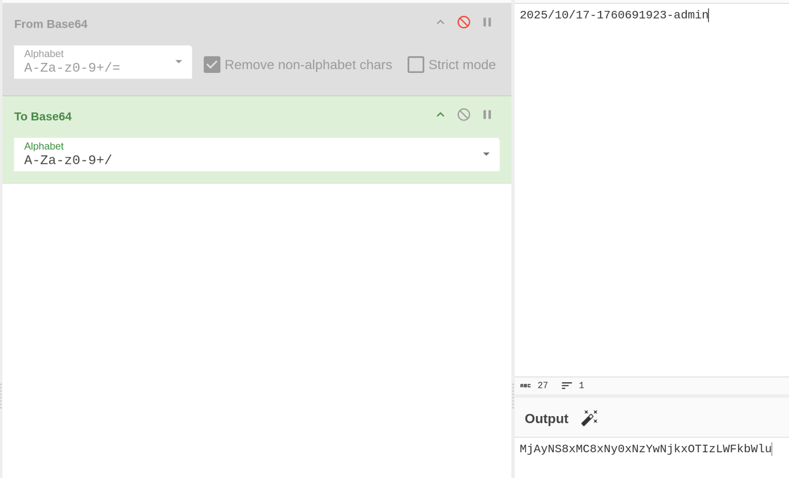

# Cookie Monster Army

http://cma.challs.olicyber.it/


## Spiegazione

Quando ci si registra al sito, in realtà non c'è interazione con alcun database.
Il tutto avviene sul client, in locale.

Viene salvato un cookie nel browser che contiene esso stesso le informazioni delle tue credenziali.

In sostanza agiamo noi stessi da database.

basta alterare il cookie per spacciarci per qualcun altro.

Il cookie è codificato in B64, quindi basta fare il reverse su cyberchef
E cambiare l'utente inserito con ```admin```




E' sufficiente inserire il nuovo cookie nel vostro browser e semplicemente aggiornare la pagina dopo il login.
```js
document.cookie = "session=MjAyNS8xMC8xNy0xNzYwNjkxOTIzLWFkbWlu"
```