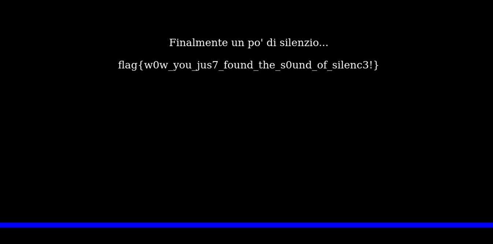

# Sound of Silence

http://soundofsilence.challs.olicyber.it/

## Spiegazione

Dal codice sorgente si capisce che bisogna inserire un input vuoto in modo da passare il primo if.

Se si modifica il form HTML in modo che l'input abbia ```name=input[]``` invece di ```name=input```.

Questo perchè strlen di un array, ritorna NULL che ritorna 0 e quindi passa il primo check.

Il input[] funziona in maniera particolare quando si fa l'append tra FLAG e l'array input.
Infatti facendo l'append, viene convertito un array in stringa, che diventa ```Array``` e quindi diventa ```flag{blablabla}Array``` e quindi il check passa.

Quindi passa il check e stampa la flag


