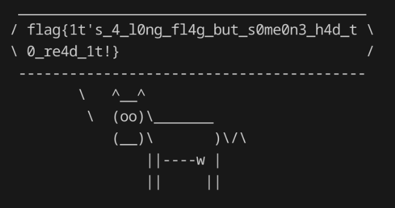

# Timp

http://timp.challs.olicyber.it/

## Spiegazione

Whitebox, quindi abbiamo il codice sorgente dell'handler.

Se notiamo, c'è una blacklist che impedisce alcuni caratteri ```/[#@%^&*_+\[\]:>?~\\\\]/```... (forse possiamo sfruttarlo.)

Inoltre notiamo che c'è un programma chiamato "cowsay" che agisce come se fosse un qualcosa simile a "cat".
Infatti c'è scritto alla riga 19 ```passthru``` che è simile ad exec.

Quindi possiamo eseguire codice arbitrario su shell del server e ce la facciamo ridare indietro tramite cowsay.

Quindi il payload è un semplice ```cowsay "$(cat /flag.txt)"```. Nessuno di questi caratteri speciali è stato bloccato se si guarda la blacklist.


Ci ritorna la flag!

